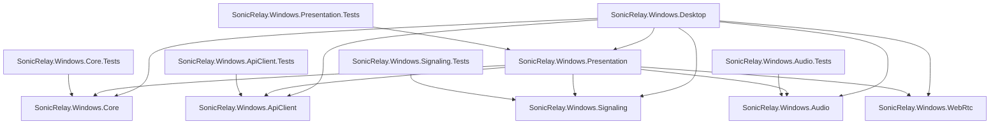
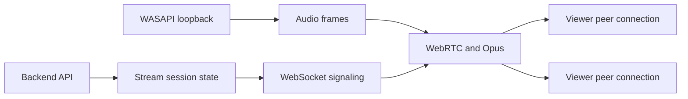

# Architecture

## Project boundaries



- **Desktop** is the Avalonia UI shell: the cross-platform window/tray/pages, plus the Windows platform adapters (WASAPI capture composition, tray). It replaced the original WinUI 3 shell once the Avalonia shell reached functional parity (issue #32); the WinUI project has been retired.
- **Presentation** is the shared, platform-neutral application layer: the publisher workflow, runtime composition (`PublisherRuntime`), capture→WebRTC pump (`WebRtcAudioBridge`), view models, the interface state machine (`PublisherUiState`), and the platform contracts under `Presentation/Platform`.
- **Core** will hold application-independent domain state and rules.
- **ApiClient** will implement typed backend HTTP communication.
- **Signaling** manages authenticated outbound WebSocket signaling messages, validated envelopes, connection state, and conservative reconnect behavior. It does not transport audio.
- **Audio** owns default-render-device WASAPI loopback capture, validated audio-frame delivery, activity metering, lifecycle state, and capture diagnostics, all behind `IAudioCaptureService`/`IAudioDeviceEnumerator`.
- **WebRtc** will own peer connections, negotiation, and Opus publication.

Capability project references establish dependency direction: Signaling depends on Core for configuration and user-scoped tokens, while Audio remains independently testable and WebRtc remains an isolated placeholder until its requirements are implemented.

## Planned runtime data flow



The UI will request operations through application-level orchestration added in later issues. Capability projects must not depend on the App project. Cross-cutting contracts should be introduced only when a concrete feature needs them.

## Multiplatform direction (issue #32)

The publisher will eventually ship on Linux from a shared Avalonia shell. The
strategy is: extract everything platform-neutral first (this phase), build the new
shell on Windows and validate parity, then add the Linux platform adapter —
never mixing a UI rewrite with a new audio-capture implementation.

Target layout:

```text
SonicRelay.Windows.Desktop       shared Avalonia UI shell (Windows today, Linux later)
SonicRelay.Windows.Presentation  shared workflow, runtime composition, view models, UI states
SonicRelay.Windows.{Core, ApiClient, Signaling, WebRtc, Audio}  shared capabilities
Platform adapters (Windows)   WASAPI loopback, Avalonia tray, window lifecycle
Platform adapters (Linux)     PipeWire capture, StatusNotifier tray, XDG autostart (future)
```

### Platform contracts

View models and the shared shell must never touch WASAPI, PipeWire, WinUI, or
Wayland/X11 directly. OS-specific capabilities sit behind contracts in
`SonicRelay.Windows.Presentation/Platform` (and the audio contracts in the Audio
project), each implemented per platform:

| Contract | Windows implementation | Linux implementation (planned) |
| --- | --- | --- |
| `IAudioCaptureService` | `AudioCaptureService` (WASAPI loopback) | PipeWire capture |
| `IAudioDeviceEnumerator` | WASAPI render endpoints | PipeWire sinks/monitors |
| `ISystemTrayService` | `Win32TrayIconService` (Shell_NotifyIcon) | StatusNotifierItem/AppIndicator |
| `IWindowLifecycleService` | `AppLifetimeService` (AppWindow) | Avalonia window lifetime |
| `INotificationService` | `TrayBalloonNotifier` | freedesktop notifications |
| `IAutoStartService` | HKCU Run key / Startup folder (future) | XDG autostart entry (future) |
| `IPlatformPermissionService` | not required for WASAPI loopback | xdg-desktop-portal (Wayland) |

Adapters are composed at the shell's composition root (today `App`/`MainWindow`
construct the Windows adapters and hand `IAudioCaptureService` to
`PublisherRuntime.Create`); the shared layer only ever sees the contracts.

### Linux audio adapter (issue #32, PR 1 of the Linux design)

`SonicRelay.Platform.Linux` implements `IAudioCaptureBackend` and
`IAudioOutputDeviceProbe` over PipeWire/WirePlumber (`pw-dump`, `wpctl
inspect`, `pw-record`), following
[`2026-07-14-linux-desktop-publisher-design.md`](superpowers/specs/2026-07-14-linux-desktop-publisher-design.md).
It is proven against the shared `AudioCaptureService`/`WebRtcAudioBridge`
pipeline by unit and integration tests using fake process runners.

### Linux desktop composition (issue #32, PR 2 of the Linux design)

`DesktopRuntimeFactory` (`src/SonicRelay.Windows.Desktop/DesktopRuntimeFactory.cs`) is
the platform composition root: on Windows it composes WASAPI capture with DPAPI
token storage (unchanged); on Linux it composes `SonicRelay.Platform.Linux`'s
`PipeWireProcessBackend`/`PipeWireOutputDeviceProbe` with a new Secret-Service-backed
`SecretServiceTokenStore` (falling back to an in-memory, session-only store when
Secret Service is unavailable — never a plaintext file). `App.axaml.cs` now attaches
a real runtime on both platforms instead of falling back to
`MainWindowViewModel.CreatePreview()` on Linux; `CreatePreview()` remains only for
the Avalonia designer and headless render tests.

Not yet covered: XDG-specific config/state/cache directory layout (the existing
`Environment.SpecialFolder.LocalApplicationData`-based paths already resolve
correctly on Linux via .NET's BCL, so this was not blocking), user-visible
actionable startup error messaging when a Linux capture dependency is missing
(today it silently falls back to the sign-in surface, matching existing Windows
behavior — not a regression, but short of the design spec's "actionable platform
error" ask), and — as before — Linux CI/packaging/distribution, tracked in a
separate follow-up (spec PR 3, issue #40). Manual, real-desktop validation (Ubuntu
24.04, real PipeWire session, real Secret Service, real tray) has not been
performed in this environment and remains the release gate per the design spec.

### Interface states

`PublisherUiState` defines the canonical states every shell must represent —
`LoggedOut`, `Authenticating`, `Idle`, `CreatingSession`, `WaitingViewer`,
`ConnectingSignaling`, `ConnectingWebRtc`, `StreamingDirect`, `StreamingRelay`,
`Reconnecting`, `Faulted`, `Ended`. `PublisherUiStateResolver` derives the state
from the publisher snapshot and WebRTC diagnostics, and
`PublisherUiCapabilities` declares each state's allowed actions, retry
availability, live-metric visibility, and tray behavior. Both are pure and unit
tested; shells bind to them instead of re-deriving conditions.

Non-admin operation remains an architectural boundary on every platform: the
Linux publisher must run without root, and capture must not require Wine or a
legacy PulseAudio path as its primary implementation.

## Error boundaries

Future external integrations will translate transport and platform failures into explicit results at their project boundaries. The UI will remain responsible for user-facing state. Unexpected failures will be logged without credentials, tokens, or raw sensitive signaling payloads.

## Deployment constraints

Non-admin operation is an architectural boundary, not a packaging preference. Installation, configuration, upgrades, and runtime must work for a standard Windows user:

- Deployment must be unpackaged and self-contained, per-user, or portable where practical and must not require elevation.
- Mutable application data must use user-scoped locations such as `%LOCALAPPDATA%` or `%APPDATA%`; Program Files and other protected system folders are read-only at runtime.
- Runtime configuration must not be stored in HKLM. User-scoped files or, when justified, HKCU are permitted.
- Normal usage must not require Windows services, custom audio drivers, kernel-mode components, or machine-wide dependencies.
- Network flows must be application-initiated outbound traffic for API, WebSocket signaling, WebRTC, TURN, and STUN. The app must not require inbound firewall ports or attempt to modify firewall rules.
- Dependency selection must include an elevation review. A dependency that requires administrator rights for normal usage is incompatible and must be rejected or replaced.

The canonical acceptance gate for future architecture and implementation work is the [non-admin checklist](non-admin-checklist.md).

## Non-goals for the bootstrap

- Authentication or token storage
- Backend URL configuration or production endpoints
- Device registration or stream-session behavior
- WebSocket connectivity
- WebRTC, SDP, ICE, or Opus behavior
- Installer and release packaging
