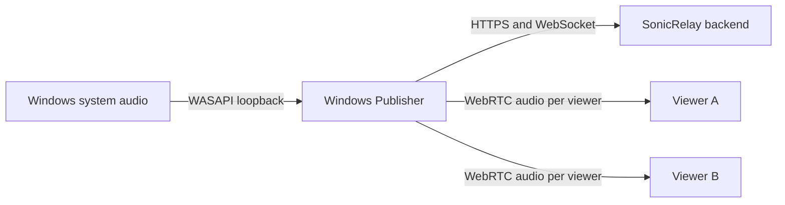
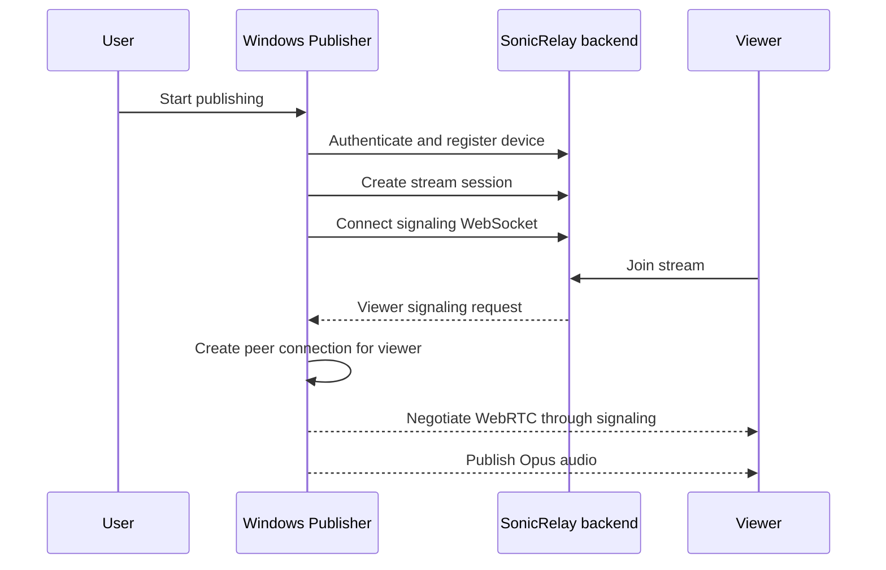

# Windows Publisher specification

## Purpose

The Windows Publisher will turn Windows system audio into a low-latency SonicRelay stream. It will be the publisher-side desktop client; playback clients and backend services live outside this repository.

The application shell, user-scoped configuration/token storage, typed backend HTTP clients, signaling client, WASAPI loopback capture, and per-viewer WebRTC/Opus publication exist today. See the [WebRTC end-to-end test](webrtc-e2e-test.md) for the manual Windows-Publisher ↔ Flutter-viewer validation of offer/answer/ICE and audio playback.

## System context

## Planned responsibilities

- Authenticate a user against the SonicRelay backend.
- Register the current machine as a `windows_publisher` device.
- Create and manage stream sessions.
- Maintain a WebSocket connection for signaling events.
- Capture system output with WASAPI loopback.
- Encode and publish audio through WebRTC with Opus.
- Maintain one `RTCPeerConnection` for each connected viewer.

The publisher will not host backend business rules, mix viewer playback, or expose a production endpoint of its own.

## Planned streaming flow

## Constraints

- Backend addresses must come from future configuration; none are hardcoded.
- Viewer isolation requires a separate peer connection for every viewer.
- Audio capture and network work must not block the UI thread.
- Secrets and access tokens must not be written to logs.

## Implemented HTTP surface

The Windows client follows the backend's documented routes: `/auth/login`, `/auth/refresh`, `/auth/me`, `/api/devices/`, `/api/sessions/`, `/api/sessions/active`, and `/api/sessions/{sessionId}/end`. Device registration fixes the backend-required pair `windows_publisher`/`windows`. The backend base URL always comes from user configuration.

These clients attach the stored opaque bearer token, refresh and retry once after an unauthorized response when possible, and map authorization, validation, conflict, network, backend, and unknown failures into typed errors. They carry control-plane JSON only; no audio or WebSocket signaling passes through this layer.

### Persistent session

The refresh token is persisted per user, DPAPI-protected, in `tokens.dat` under `%LocalAppData%\SonicRelay\WindowsPublisher` (`UserScopedTokenStore`); tokens are never written in plaintext or logged. On startup — and whenever the backend is (re)configured — `PublisherWorkflow.RestoreSessionAsync` calls `/auth/me` (which transparently refreshes an expired access token using the stored refresh token) and re-resolves this machine's `windows_publisher` device, so the user stays signed in across app restarts and reboots without re-entering credentials. An invalid/expired refresh token clears local auth and returns to the sign-in screen; a transient network error leaves the app signed out without an error banner so the user can retry. The publisher device is matched by hostname and reused, so restarts never create duplicate devices. Logout clears the stored tokens and resets the session/device cache.

## WASAPI loopback capture

The Audio capability opens the default Windows render endpoint in WASAPI shared loopback mode. This is a user-mode Core Audio API: it installs no driver, starts no service, changes no global device setting, and requires no administrator privilege. The Audio page can start, pause, resume, and stop capture while displaying the selected endpoint, native mix format, live peak activity, captured frame/byte counters, state, and the last mapped error.

Frames use the endpoint's native shared-mode mix format, currently IEEE float 32-bit or PCM 16-bit. Loopback normally yields silence when no application is playing audio. Capture follows the default endpoint selected at start; removing or invalidating that endpoint faults the capture cleanly, after which the user can stop and restart against the current default device. Windows may exclude protected content. This layer does not resample, encode Opus, create WebRTC peers, or transmit audio.

## Audio quality profiles

Captured audio is always encoded with Opus before it leaves over WebRTC; raw
PCM/Float32 is never sent on the wire. The Audio page exposes a **Stream quality**
selector so the user can trade bandwidth against fidelity:

| Profile | Channels | Opus bitrate | Frame | Use |
|---|---|---|---|---|
| Voice / Economy | Mono | 32 kbps | 20 ms | calls, voice |
| Balanced | Stereo | 96 kbps | 20 ms | general use |
| High quality | Stereo | 128 kbps | 20 ms | music, media (default) |
| Custom | 1–2 | 16–192 kbps | 10/20/40 ms | advanced |

The sample rate stays fixed at 48 kHz for Opus/WebRTC compatibility. WASAPI
loopback still captures the endpoint's native mix format; the accumulator
down/upmixes and resamples to the selected channel count and frame size before
the encoder. The selected profile is persisted per user in
`%LocalAppData%\SonicRelay\WindowsPublisher\audio-quality.json` (via
`AudioQualityStore`) and restored on startup. It is read when each viewer's peer
connection is created, so a change applies to the next stream; the selector is
disabled while capture is running and a hint asks the user to restart capture to
apply a different profile. The page shows the effective codec settings (codec,
bitrate, channels, frame duration, sample rate) and an approximate traffic
estimate (kbps, MB/min, MB/hour) derived from the Opus bitrate.

## Publisher dashboard

The **Dashboard** page (`PublisherDashboardPage`) is a dark, card-based monitor
aligned with the Flutter Audio Monitor style, driven entirely by existing publisher,
signaling, WebRTC, and audio-metering state. Its colours come from a single locked
palette (`Styles/SonicPalette.xaml`) exposed as named `Sonic.*` brushes; no other
colours are introduced for the dashboard.

A pure, unit-tested `DashboardViewModel` (in `SonicRelay.Windows.Presentation`)
projects the state into always-non-null display values, so the XAML holds no
business logic. The page rebuilds the ViewModel from `Workflow.StateChanged` and
`IWebRtcPublisher.DiagnosticsChanged` and pushes it to lightweight controls
(`StatusBadgeControl`, `MetricCardControl`, `AudioVisualizerControl`,
`ConnectionStatusCard`, `QualityMetricsCard`).

It shows:

- **Session** status (Idle / Waiting / Streaming / Error), **Signaling** status
  (Connected / Connecting / Reconnecting / Disconnected / Failed), and aggregated
  **WebRTC/ICE** status, each as a colour-coded badge.
- **Connection mode** (Direct / Relay / Unknown), the session **code**, and the
  live **viewer** count.
- An **audio visualizer** — a row of teal/blue gradient bars eased from the capture
  level meter, animating while capturing and resting on a flat line when idle.
- **Latency / RTT**, **jitter** and **packet loss** from the connected viewer's RTCP
  reports about our audio stream, and **bitrate** from the negotiated Opus send bitrate
  (issue #32). RTT is derived by correlating each sender report we emit with the receiver
  report that echoes it (see `RtcpRoundTripEstimator`).

Values with no reading yet are shown safely as `—` (until the first RTCP report
correlates). Design-time mock data (`DashboardViewModel.DesignTime`) lets the page preview
without a session.

## ICE servers and force relay

`PublisherRuntime.Create` wires a `BackendIceServersProvider`
(`SonicRelay.Windows.ApiClient`) that fetches STUN/TURN servers — including
short-lived TURN credentials — from the authenticated backend endpoint
`GET /api/webrtc/ice-servers`, which serves the SonicRelay coturn deployment.
Results are cached until shortly before the TURN credentials expire. The
public Google STUN server (`stun:stun1.google.com:19302`) is used only as a
last-resort fallback in **debug builds** when that request fails and there is
no cache yet; release builds instead get an empty ICE server list rather than
silently depending on it.

`RelayPreferenceStore` (`SonicRelay.Windows.Core.Configuration`) persists a
"force relay" (TURN-only) preference; when set, `SipSorceryPeerConnectionFactory`
builds the peer connection with `iceTransportPolicy = relay` instead of the
default `all`, restricting ICE to relayed candidates. This is useful for
debugging NAT traversal against the coturn relay end-to-end, at the cost of
extra latency and relay bandwidth — leave it off unless diagnosing a
connectivity issue.

## Audio source selection

By default the publisher captures the current Windows **default** render endpoint.
The Audio page's **Audio source** section lets the user instead pick a specific
output device: it lists the active render endpoints (via Core Audio / MMDevice,
read-only, no elevation), marks the current default, and offers a "System default"
option that follows whatever Windows chooses. The selection is persisted per user
in `%LocalAppData%\SonicRelay\WindowsPublisher\audio-output.json`
(`AudioOutputPreferenceStore`) and restored on startup via
`AudioCaptureService.SelectOutputDevice`.

The chosen device is opened at the next capture start (WASAPI loopback on that
endpoint), so a change applies when capture is (re)started; the picker is disabled
while capturing. If a previously saved device is no longer present when capture
starts, the capture layer **falls back safely to the system default** and the page
shows a note explaining the fallback. Enumeration is entirely defensive — any COM
failure simply yields the default-only behaviour.

**Limitation (deferred):** publishing a *mix* of several output devices as one
track is out of scope for now; a single output endpoint is captured. The capture
layer is kept isolated so per-application or multi-device filtering can be added
later without reworking the WebRTC/Opus path.

## Background run and system tray

The publisher keeps running when the main window is minimized or closed, so audio
publishing (signaling + WebRTC + capture) survives with the window hidden. The
publisher pipeline is owned by the app (`App.Runtime`), not the window, so hiding
the window never tears it down — only an explicit **Quit** does.

The behaviour is driven by `TrayApplicationController` (a pure, unit-tested decision
core in `SonicRelay.Windows.Presentation`) wired to three platform contracts from
`SonicRelay.Windows.Presentation.Platform` (issue #32), each implemented by an
App-layer Windows adapter: `ISystemTrayService` (Win32 `Shell_NotifyIcon`),
`IWindowLifecycleService` (hide/show/quit over `AppWindow`), and
`INotificationService` (tray balloon toasts).
The streaming/audio/WebRTC layers never depend on any of these.

- **Close / minimize** hide the window to the notification area when *Keep running in
  tray* is on, or whenever a stream is active (so closing the window mid-stream never
  drops viewers). With the setting off and no active stream, closing quits normally.
- **Tray menu** (right-click): Open SonicRelay, a status header, Start/Stop stream,
  Copy session code (only with a code), Reconnect signaling (only when disconnected
  with a session), and Quit SonicRelay. Double-click restores and focuses the window.
- **Quit** disposes audio → WebRTC → signaling, removes the tray icon, and exits.
- **Notifications** (gated by the *Show background/tray notifications* setting) fire
  for minimized-to-tray (first time), stream start/stop, and viewer connect/disconnect
  — only while the window is hidden, and never during normal reconnect churn.

Settings live on the **Settings** page and persist per user in
`%LocalAppData%\SonicRelay\WindowsPublisher\tray.json`
(`TrayBackgroundPreferenceStore`): *Keep running in tray* (default on),
*Start minimized to tray* (default off), *Show notifications* (default on). A
missing/corrupt file falls back to defaults.

No admin, no driver, no Windows Service, and no local listening port are required;
the tray uses only user-level shell interop.

### Manual QA

1. Start a stream, then **minimize** — the window hides to the tray and the stream
   keeps running (verify the viewer stays connected).
2. **Close** the window during an active stream — the app stays alive in the tray;
   a first-time notification explains it is still running.
3. Right-click the tray icon — the menu shows the current status and **Stop stream**;
   pick it and confirm capture stops.
4. **Double-click** the tray icon (or **Open SonicRelay**) — the window restores and
   focuses, showing the correct current session/signaling/audio state.
5. **Copy session code** from the tray and paste it elsewhere to confirm the clipboard.
6. Disconnect the network briefly and use **Reconnect signaling** from the tray.
7. **Quit SonicRelay** from the tray — audio, WebRTC peer connections, and signaling
   close, the tray icon disappears, and the process exits. No duplicate device or
   session was created by hiding/restoring.

## Non-admin requirement

The Windows Publisher must install, configure, and run as a standard Windows user without elevation. Its normal operation must not depend on an administrator-approved installer, Windows service, custom audio driver, kernel-mode component, machine-wide runtime, inbound firewall rule, HKLM configuration, or runtime writes to protected locations such as Program Files.

Distribution should be unpackaged and self-contained, per-user, or portable where practical. Configuration, tokens, logs, and other mutable data must use user-scoped folders. API, signaling, WebRTC, TURN, and STUN traffic must be initiated outbound by the application; the publisher must not assume it can open an inbound port or modify firewall rules.

Dependencies that require elevation for normal usage are incompatible and must be rejected. Future implementation and release work must be reviewed against the [non-admin checklist](non-admin-checklist.md).

## Diagnostics and safe sharing

The Diagnostics page shows the current backend, authentication, device, session, signaling, audio capture, and WebRTC status. Structured JSON Lines logs are stored per user in `%LocalAppData%\SonicRelay\WindowsPublisher\logs`; exported Markdown reports are stored in the adjacent `diagnostics` folder. Neither operation requires elevation or writes to Windows Event Log.

Exported diagnostic reports are designed to be safe to attach to a support request: identifiers are masked, backend URLs contain only scheme/host/port, and credentials, tokens, passwords, email addresses, SDP bodies, and ICE candidates are redacted. Do not share `tokens.dat`, `appsettings.json`, raw signaling captures, memory dumps, or any manually collected SDP/ICE payload even when sharing an exported report.

## Current deliverable

The bootstrap provides a WinUI 3 application, capability-oriented class libraries, focused test projects, shared build settings, and documentation. It deliberately contains no simulated endpoints or placeholder production behavior.
