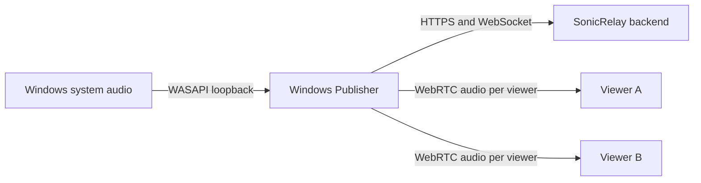
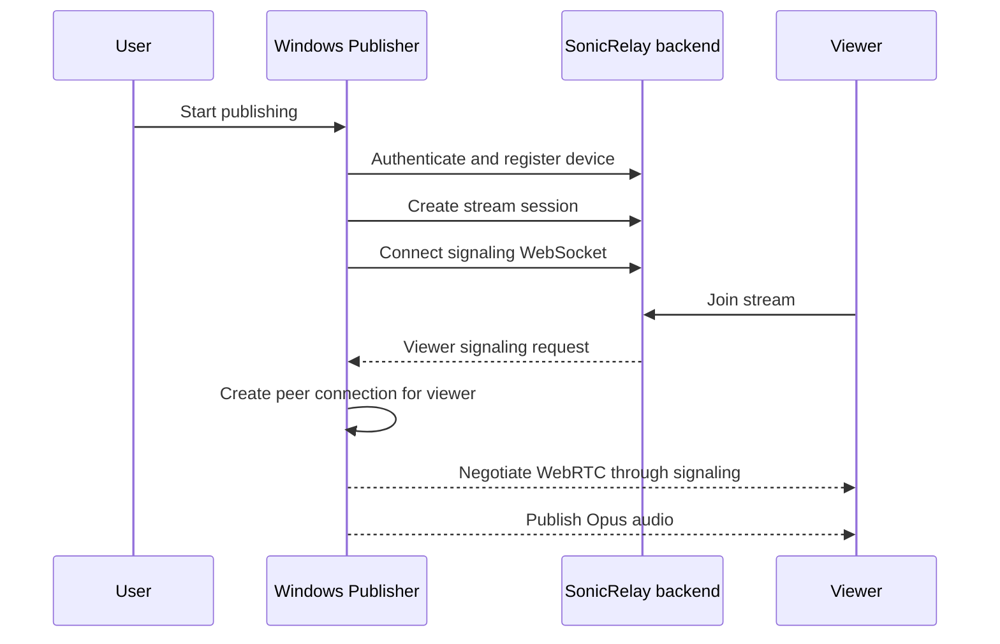

# Windows Publisher specification

## Purpose

The Windows Publisher will turn Windows system audio into a low-latency SonicRelay stream. It will be the publisher-side desktop client; playback clients and backend services live outside this repository.

Only the application shell and project boundaries exist today. Every runtime interaction below is a target architecture, not current behavior.

## System context

## Planned responsibilities

- Authenticate a user against the SonicRelay backend.
- Register the current machine as a `windows_publisher` device.
- Create and manage stream sessions.
- Maintain a WebSocket connection for signaling events.
- Capture system output with WASAPI loopback.
- Encode and publish audio through WebRTC with Opus.
- Maintain one `RTCPeerConnection` for each connected viewer.

The publisher will not host backend business rules, mix viewer playback, or expose a production endpoint of its own.

## Planned streaming flow

## Constraints

- Backend addresses must come from future configuration; none are hardcoded.
- Viewer isolation requires a separate peer connection for every viewer.
- Audio capture and network work must not block the UI thread.
- Secrets and access tokens must not be written to logs.

## Non-admin requirement

The Windows Publisher must install, configure, and run as a standard Windows user without elevation. Its normal operation must not depend on an administrator-approved installer, Windows service, custom audio driver, kernel-mode component, machine-wide runtime, inbound firewall rule, HKLM configuration, or runtime writes to protected locations such as Program Files.

Distribution should be unpackaged and self-contained, per-user, or portable where practical. Configuration, tokens, logs, and other mutable data must use user-scoped folders. API, signaling, WebRTC, TURN, and STUN traffic must be initiated outbound by the application; the publisher must not assume it can open an inbound port or modify firewall rules.

Dependencies that require elevation for normal usage are incompatible and must be rejected. Future implementation and release work must be reviewed against the [non-admin checklist](non-admin-checklist.md).

## Current deliverable

The bootstrap provides a WinUI 3 application, capability-oriented class libraries, focused test projects, shared build settings, and documentation. It deliberately contains no simulated endpoints or placeholder production behavior.
